# School_District_Analysis

## Challenge overview

### Background

The grades of the ninth graders at Thomas High School have been changed. While administrators do not know the full extent of this academic dishonesty, they want to uphold the standards of state testing and have turned to you for help.

After assessing the situation with the school superintendent and Maria, you decide the best approach is to:

- Replace the ninth-grade math and reading scores from Thomas High School.
- Keep all other data associated with the ninth-grade students and Thomas High School intact.

### Objectives
The goals of this challenge are for you to:
- Filter DataFrames using logical operators.
- Replace the incorrect values with NaN.
- Explain how your PyCitySchools analysis changes after you handle the incorrect data. 

### Analysis Results
#### District Summary 
##### Without data alteration
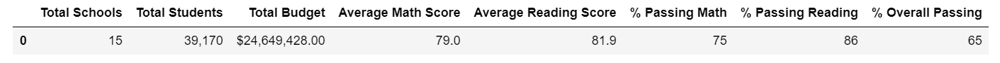

##### With data alteration
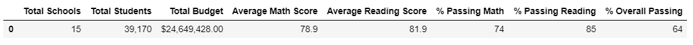

##### Conclusion

---
#### School Summary 
##### Without data alteration
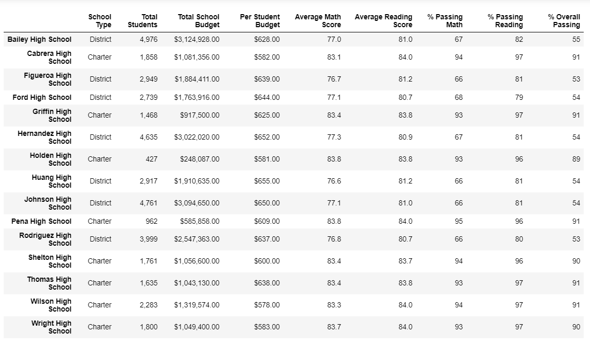

##### With data alteration
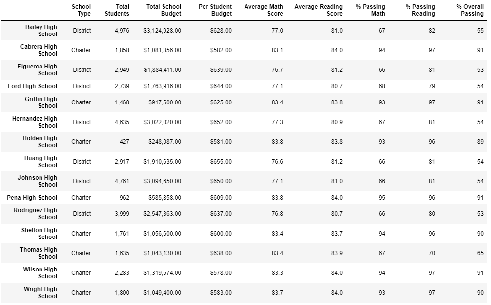

##### Conclusion

---
#### Top 5 School Summary 
##### Without data alteration
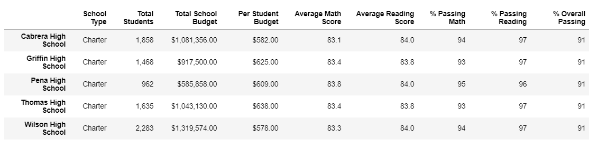

##### With data alteration
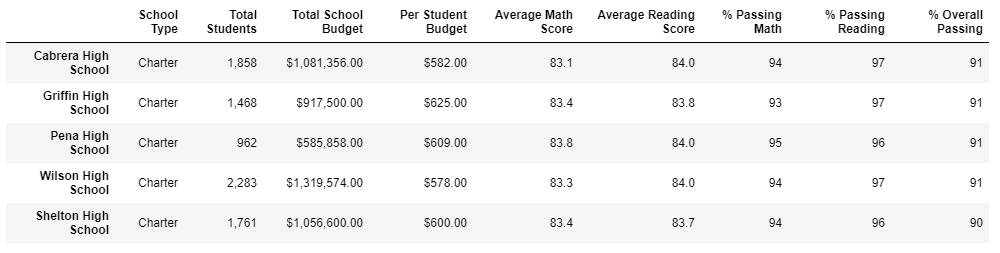

##### Conclusion

---
#### Bottom 5 School Summary 
##### Without data alteration
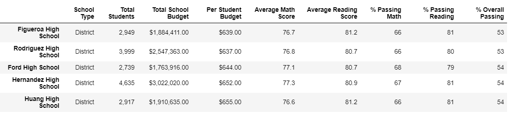

##### With data alteration
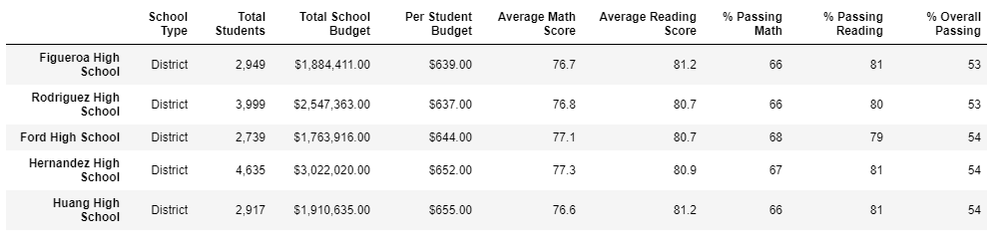

##### Conclusion

---
#### Math Score by Grades
##### Without data alteration
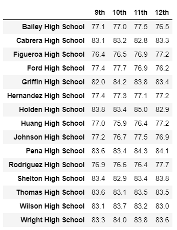

##### With data alteration
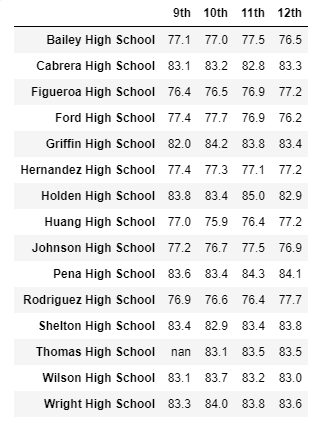

##### Conclusion

---
#### Reading Score by Grades
##### Without data alteration
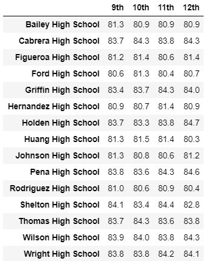

##### With data alteration
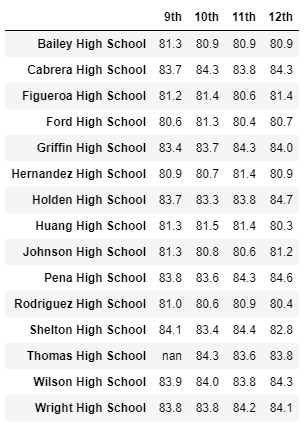

##### Conclusion

---
#### Score by School Spending
##### Without data alteration
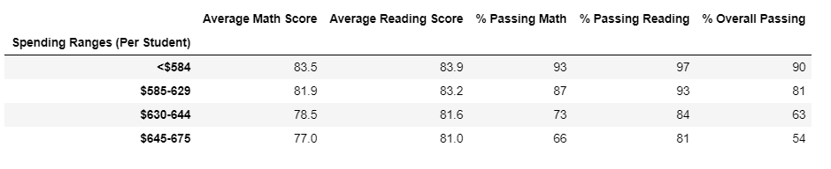

##### With data alteration
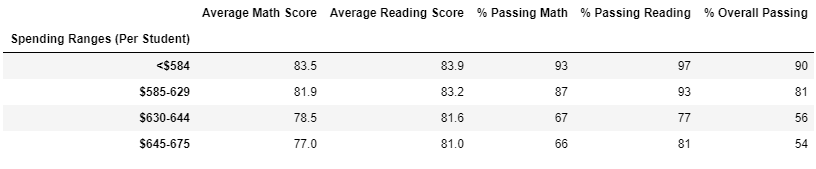

##### Conclusion

---
#### Score by School Size
##### Without data alteration
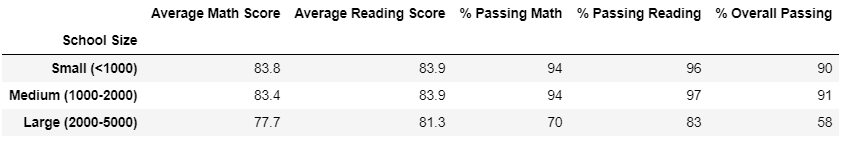

##### With data alteration
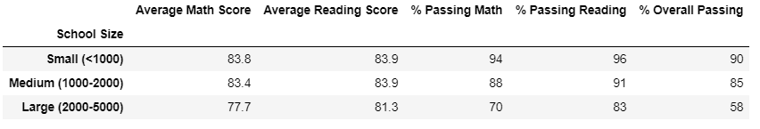

##### Conclusion

---
#### Score by School Type
##### Without data alteration
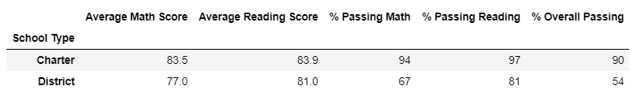

##### With data alteration
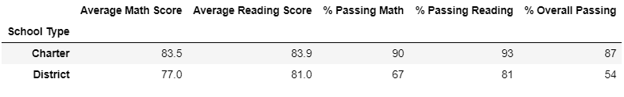

##### Conclusion

---
